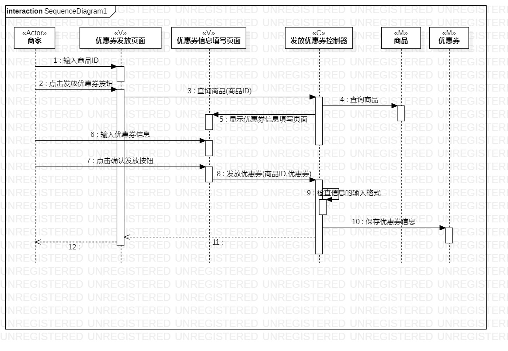

# 实验六：对象交互建模  

## 一、实验目标  
1. 理解系统交互；  
2. 掌握UML顺序图的画法；  
3. 掌握对象交互的定义与建模方法。  

## 二、实验内容  
1. 根据用例模型和类模型，确定功能所涉及的系统对象；  
2. 在顺序图上画出参与者（对象）；  
3. 在顺序图上画出消息（交互）。  

## 三、学习笔记  
1. A sequence diagram describes the order in which the interactions take place,so time is an important factor.（描述了交互发生的顺序）  
2. Time on a sequence diagram starts at the top of the page,just beneath the topmost participant heading,and then progresses down the page.（时间顺序——从上到下）  
3. Time on a sequence diagram is all about ordering,not duration.（时间仅表示先后顺序，不表示时间跨度）  
4. An event is any point in an interaction where something occurs.  
5. An activation bar can be shown on the sending and receiving ends of a message.（存活条显示了发送端和接收端，注：所有的消息都要画在存活条上）   
6. 为了图的简洁，可以不画返回消息.  

## 四、实验步骤  
1. 从用例图找到第1个参与者（Actor）；  
2. 从类图找到N个参与者（View、Control、Model都是参与者）；  
3. 从活动图找到操作步骤，画出参与者之间的消息；  
4. 在画顺序图的过程中，发现有些地方是不正确的，对用例规约、活动图、类图依此进行修改；  
5. 继续画顺序图，若再发现不正确的，回到步骤4；
6. 如此反复执行步骤4和步骤5，直到成功完成顺序图。  

## 五、实验结果   
  
图1：发放优惠券的顺序图  
  
  
图2：领取优惠券的顺序图  

## 六、实验总结  
这次的实验再一次让我感受到了前面实验的重要性，前面的实验如果完成得好，相当于给后面的实验打下了稳固的基础。我就是前面的实验完成得不太好，有些地方没有想清楚如何去设计，以至于在此次画顺序图的过程中，不断地发现不合理的点，需要倒回去修改用例规约、活动图、类图。虽然这一个过程很麻烦，但随着不断地修改，自己对这个系统的设计思路越来越清晰，这无疑对后面实验的开展有巨大的帮助。   
