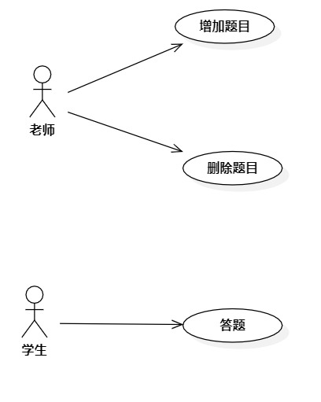

# 实验二：用例建模

## 1.实验目标

-理解并使用用例建模
-理解用例规约

## 2.实验内容

-确认issues选题：#465我爱做题网
-进行用例建模
-编写用例规约

## 3.实验步骤

（1）确认我爱做题网功能
- 增加题目
- 删除题目
- 答题

（2）用例建模
- 确定参与者
    - 老师
    - 学生
- 确定用例
    - 增加题目
    - 删除题目
    - 答题

## 4.实验结果

图1：我爱做题网的用例图

## 表1：增加题目用例规约  

用例编号  | 01 | 备注  
-|:-|-  
用例名称  | 增加题目  |   
前置条件  |   老师登录题库管理界面   | *可选*   
后置条件  |      | *可选*   
基本流程  | 1.老师点击【新增题目】按钮  |*用例执行成功的步骤*    
~| 2.老师输入题目信息  |  
~| 3.老师点击"保存"按钮  | 
~| 4.系统提示【保存成功窗】 | 
~| 5. 系统检查题目信息是否完整填写 |
~| 6. 系统检查题目信息是否合法 |
~| 7. 系统保存题目信息 |
扩展流程  | 5.1 系统检查题目信息未完整填写，提示【请完善题目信息】  |*用例执行失败* 
~| 6.1 检查题目信息不合法，提示【输入信息不合法】  |

## 表2：删除题目用例规约  

用例编号  | 02 | 备注  
-|:-|-  
用例名称  | 删除题目  |   
前置条件  |   老师登录题库管理界面  | *可选*   
后置条件  |      | *可选*   
基本流程  | 1.老师选择题目点击【删除题目】按钮  |*用例执行成功的步骤*  
~| 2.系统检查该题目是否存在  |  
~| 3.系统提示【删除成功】  |   
扩展流程  | 2.1系统检查题目不存在，提示【题库中暂无题目】   |*用例执行失败*    

## 表3：答题用例规约  

用例编号  | 03 | 备注  
-|:-|-  
用例名称  | 答题  |   
前置条件  |   学生登录答题页面  | *可选*   
后置条件  |      | *可选*   
基本流程  | 1.学生进行答题  |*用例执行成功的步骤*  
~| 2.学生点击"提交"按钮  |  
~| 3.系统检查是否有未填题目  |   
~| 4.显示题目答案  | 
扩展流程  | 3.1系统检查存在未填题目，提示【有题目未填】   |*用例执行失败*    
