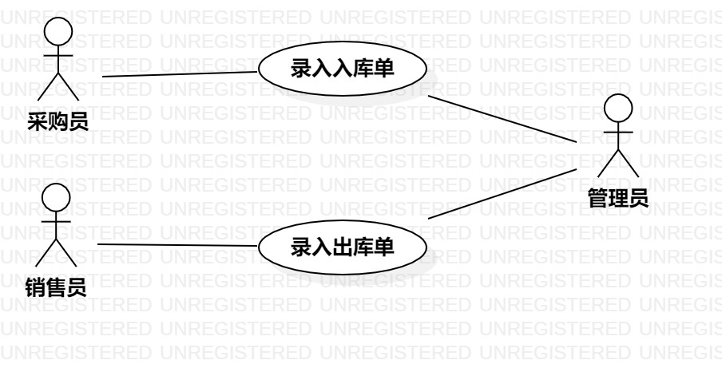

# 实验2：UML用例建模

## 一、实验目标

1.学习用例图的画法

2.熟练使用StartUML

3.创建自己的选题

## 二、实验内容

1.根据选题创建用例图

2.编写用例规约

## 三、实验步骤

1.确定选题：药品销售企业进销存管理系统

2.确定参与者(Actor)：
	-管理员
	-销售员
	-采购员

3.确定用例(UserCase)：
	-录入入库单
	-录入出库单
	
4.画用例图(Lab2_UserCaseDiagram)

5.编写用例规约

## 四、实验结果

1. 画图

图1:医药销售企业进销存管理系统用例图

## 表1：录入入库单用例规约  

用例编号  | UC01 | 备注  
-|:--|-  
用例名称  | 录入入库单  |   
前置条件  |  采购员或管理员登录进入医药销售企业进销存管理系统   |
后置条件  |  采购员或管理员进入入库单填写页面     |   
基本流程  | 1. 采购员或管理员点击录入入库单链接；  |*用例执行成功的步骤*    
~| 2. 系统显示入库单录入页面；  |   
~| 3. 采购员或管理员填写入库的药品信息，点击入库按钮；  |   
~| 4. 系统检查入库的各项信息正确； |   
~| 5.系统执行入库操作； |  
~  | 6.系统保存入库单信息； |                      
~ | 7. 系统显示入库成功。 | 
扩展流程 | 4.1 系统检查发现入库信息格式错误，系统提示信息格式错误 |*用例执行失败* 
 | 5.1 系统检查发现数量或价格小于等于0，系统显示入库失败 |*用例执行失败* 

## 表2：录入出库单用例规约  

用例编号  | UC02 | 备注  
-|:-|-  
用例名称  | 录入出库单  |   
前置条件  |  销售员或管理员登录进入医药销售企业进销存管理系统   |
后置条件  |  销售员或管理员进入出库单填写页面     |  
基本流程  | 1. 销售员或管理员点击录入出库单链接；  |*用例执行成功的步骤*    
~| 2. 系统显示出库单录入页面；  |   
~| 3. 销售员或管理员填写要出库的药品的信息，点击出库按钮；  |   
~| 4. 系统检查出库信息格式正确； |   
~| 5.系统执行出库操作； |  
~  | 6.系统保存出库单信息； |    
~ | 7. 系统显示出库成功。 | 
扩展流程 | 4.1 系统检查发现出库信息格式错误，系统提示信息格式错误 |*用例执行失败* 
 | 5.1 系统检查发现数量或价格小于等于0，系统显示出库失败 |*用例执行失败* 
 | 5.2 系统检查发现药品不存在，系统显示出库失败 |*用例执行失败* 
