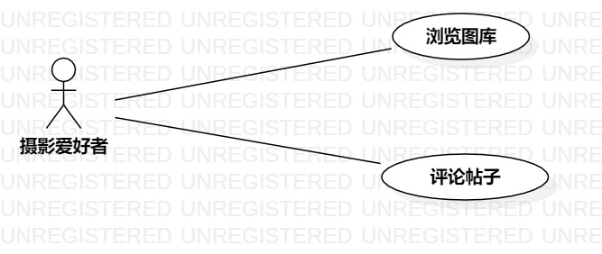

# 实验二：用例建模

## 一、 实验目标

- 掌握Markdown的基本使用
- 学会使用StarUML用例建模
- 学会编写用例规约

## 二、 实验内容

- 使用StarUML新建用例图并根据选题画出用例图
- 细化需求，编写用例规约

## 三、 实验步骤

3.1 在issue（#1195）里提交选题（青年摄影交流系统）和功能介绍

3.2 绘制用例图

（1）根据选题添加参与者
- 摄影爱好者

（2）根据选题添加用例
- 浏览图库
- 评论帖子

（3）建立参与者与用例之间的联系

3.3 编写用例规约

## 四、 实验结果

图1：青年摄影交流系统的用例图

## 表1：浏览图库用例规约  

用例编号  | UC01 | 备注  
-|:-|-  
用例名称  | 浏览图库  |   
前置条件  | 登录青年摄影交流系统     | *可选*   
后置条件  |      | *可选*   
基本流程  | 1.摄影爱好者点击图库链接  |*用例执行成功的步骤*    
~| 2.系统检查符合等级要求，显示相关图库内容  |   
扩展流程  | 2.1系统检查不符合等级要求，提示“等级过低，暂时无法浏览”   |*用例执行失败*    

## 表2：评论帖子用例规约  

用例编号  | UC02 | 备注  
-|:-|-  
用例名称  | 评论帖子  |   
前置条件  | 进入帖子浏览界面    | *可选*   
后置条件  | 帖子评论成功     | *可选*   
基本流程  | 1.摄影爱好者点击评论链接  |*用例执行成功的步骤*    
~| 2.系统显示评论编辑界面  |   
~| 3.摄影爱好者输入内容，点击发送   |   
~| 4.系统检查评论符合要求，保存评论信息，提示“评论成功”   |   
扩展流程  | 4.1系统检查发现评论内容为空，提示“评论内容为空”   |*用例执行失败*    
~| 4.2系统检查发现帖子已被删除，提示“帖子不存在”   |
~| 4.3系统检查发现不符合等级要求，提示“等级过低，暂时无法评论”   |
~| 4.4系统检查发现被禁言，提示“已被禁言，无法评论”   |
