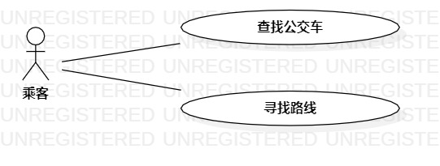

# 实验二：用例建模

## 一、实验目标

1. 掌握使用Markdown编写实验报告
2. 熟悉用例建模流程
3. 使用StarUML创建用例图

## 二、实验内容

1. 使用Markdown编写实验报告
2. UML建模选题
3. 用例建模与用例图概念讲解
4. 用例图画图过程示例
5. 编写用例规约

## 三、实验步骤

1. 在issues中创建UML建模选题，并写出两到三个功能需求
2. 在StarUML创建用例图
3. 根据选题确定参与者为“乘客”
4. 确定用例为
   - 查找公交车
   - 寻找路线
5. 创建对应关系
6. 导出用例图
7. 根据用例图编写用例规约，完成实验报告

## 四、实验结果

图1. 实时公交查询系统用例图

## 表1：查找公交车用例规约  

用例编号  | UC01 | 备注  
-|:-|-  
用例名称  | 查找公交车  |   
前置条件  |   |  
后置条件  | 乘客进入公交车定位页面     |  
基本流程  | 1. 乘客输入公交车车次，点击查询按钮；  | 
~| 2. 系统检测到车次不为空，查询车次信息；  | 
~| 3. 系统检查车次在营运时间内，请求实时位置；  |
~| 4. 系统接收到位置； |
~| 5. 系统显示车次地理位置页面； |
扩展流程  | 2.1 系统检测到车次为空，提示“车次不能为空”| 
~| 3.1 系统检查车次不在营运时间内，提示“该车次未营运”| 
~| 4.1 系统接受实时位置失败，提示“定位失败”|

## 表2：寻找路线规约  

用例编号  | UC02 | 备注  
-|:-|-  
用例名称  | 寻找路线  |   
前置条件  |   |  
后置条件  | 乘客进入路线导航页面     |  
基本流程  | 1. 乘客在地图上选择目的地，点击寻路按钮；  | 
~| 2. 系统检测定位功能打开，查询最佳路线；  | 
~| 3. 系统请求到实时路况|
~| 4. 计算最佳路线；|
~| 5. 系统显示最佳路线页面；  |   
扩展流程  | 2.1 系统检查定位功能没有打开，提示“定位失败，请打开定位功能”| 
~| 3.1 系统请求路况失败，根据路线长短计算最佳路线|

