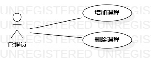

# 实验二

## 一、实验目标
1.学习用例建模  

## 二、实验内容
1.确定个人建模选题，将其填写在Issues中  
2.完成选题用例图  
3.编写用例规约  

## 三、实验步骤
1.在GitHub上提交个人建模选题  
2.根据选题，使用StarUMl绘制Use Case Diagram  
3.使用Markdown编写实验报告  

## 四、实验结果
1.选题：课程管理系统：管理员进行对课程类型以及课程的管理  
       增加或管理课程类型：根据学院要求增加新开的课程类型，或对已有的课程类型进行删除或修改  
       增加或管理课程：根据学院要求增加新开的课程，或对已有的课程进行删除或修改，在课程数量大的情况下，可使用查询功能，进而使用其他功能
       
  
图1：课程管理系统的用例图  

## 表1：增加或管理课程类型用例规约  

用例编号  | UC01 | 备注  
-|:-|-  
用例名称  | 增加或管理课程类型  |   
前置条件  |      | *可选*   
后置条件  |      | *可选*   
基本流程  | 1.  管理员点击新增课程类型按钮 |*用例执行成功的步骤*    
~| 2.  系统显示新增课程类型页面  |   
~| 3.  管理员输入所要增加的课程类型名，点击确定按钮  |   
~| 4.  系统显示课程类型管理页面  |   
~| 5.  管理员点击课程类型管理按钮  |  
~| 6.  系统显示课程类型管理页面  |  
~| 7.  管理员点击修改按钮  |  
~| 8.  系统显示修改课程页面  |  
~| 9.  管理员输入修改信息，点击确定按钮  |  
~| 10.  系统显示课程类型管理页面  |  
~| 11.  管理员点击删除按钮  |  
~| 12.  系统显示询问删除页面  |  
~| 13.  管理员点击确定按钮或取消按钮  |  
~| 14.  系统显示课程类型管理页面  |  
扩展流程  | 4.1  系统检查课程类型已存在，不可增加   |*用例执行失败*    

## 表2：增加或管理课程用例规约  

用例编号  | UC02 | 备注  
-|:-|-  
用例名称  | 增加或管理课程  |   
前置条件  |      | *可选*   
后置条件  |      | *可选*   
基本流程  | 1.  管理员点击开课登记按钮 |*用例执行成功的步骤*    
~| 2.  系统显示新增课程页面  |   
~| 3.  管理员输入所要增加的课程信息，点击开设课程按钮  |   
~| 4.  系统显示课程管理页面  |   
~| 5.  管理员点击课程管理按钮  |  
~| 6.  系统显示课程管理页面  |  
~| 7.  管理员点击修改按钮  |  
~| 8.  系统显示修改课程页面  |  
~| 9.  管理员输入修改信息，点击确定按钮  |  
~| 10.  系统显示课程管理页面  |  
~| 11.  管理员点击删除按钮  |  
~| 12.  系统显示询问删除页面  |  
~| 13.  管理员点击确定按钮或取消按钮  |  
~| 14.  系统显示课程类型管理页面  |  
~| 15.  管理员输入课程名称或学分范围或课程类型，点击查询按钮  |  
~| 16.  系统查询课程信息，显示查询结果  |  
扩展流程  | 4.1  系统检查课程已存在，不可增加   |*用例执行失败*    
