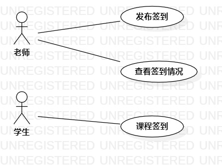

# 实验二：用例建模

## 一、实验目标

1. 选题，并用例建模
3. 用markdown编写实验报告

## 二、实验内容

1. 创建所选题的用例图
2. 编写规约和实验二报告文档

## 三、实验步骤

1. 选题：网课签到系统
2. 确定系统三个主要功能 
- 发布签到
- 课程签到 
- 查看签到情况
3. 新建用例图 
- 添加两个actor：老师和学生
- 添加老师use case：发布签到、查看签到情况
- 添加学生use case：课程签到
- 建立关系association
4. 编写用例规约

## 四、实验结果

  
图1. 网课签到系统的用例图

## 表1：发布签到用例规约  

用例编号  | UC01 | 备注  
-|:-|-  
用例名称  |  发布签到 |   
前置条件  |  用户身份为老师，已经登录   | *可选*   
后置条件  |  老师成功发布签到   | *可选*   
基本流程  | 1. 老师点击发布签到按钮；  |*用例执行成功的步骤* 
~| 2. 系统显示课程签到信息填写页面； |  
~| 3. 老师输入签到的课程名称和时间，点击确认按钮；  | 
~| 4. 系统检查签到的课程名称和时间均不为空，并记录该老师发布的签到信息； |
~| 5. 系统显示“课程签到信息发布成功”； |
扩展流程  | 4.1 系统检查签到的课程名称和时间均为空，提示"课程名称和时间均不为空，请按要求填写信息"； |*用例执行失败* 
~| 4.2 系统检查签到的课程名称为空或签到的时间为空，提示"课程名称和时间均不为空，请按要求填写信息"； |

## 表2：课程签到用例规约  

用例编号  | UC02 | 备注  
-|:-|-  
用例名称  |  课程签到 |   
前置条件  |  用户身份为学生，已经登录，老师已发布签到信息   | *可选*   
后置条件  |  老师成功发布签到信息   | *可选*   
基本流程  | 1. 学生点击签到按钮；  |*用例执行成功的步骤* 
~| 2. 系统检索已发布签到信息，并显示已发布签到的全部课程； | 
~| 3. 学生点击目标课程； |
~| 4. 系统检查学生签到时间在课程签到时间内，并记录该学生已签到； |
~| 5. 系统显示“课程签到成功”； |
扩展流程  | 2.1 系统未检索到发布签到信息； |*用例执行失败*
~| 2.2 显示已发布签到的全部课程中没有目标课程； |
~| 4.1 系统检查学生签到时间不在课程签到时间内，提示"签到失败"，并记录该学生迟到； |
~| 4.2 系统未检查到学生签到时间，并默认该学生缺勤； |

## 表3：查看签到情况用例规约  

用例编号  | UC03 | 备注  
-|:-|-  
用例名称  |  查看签到情况 |   
前置条件  |  用户身份为老师，已经登录，在签到时间段内或者签到结束之后   | *可选*   
后置条件  |  系统显示学生签到情况   | *可选*   
基本流程  | 1. 老师点击查看签到按钮；  |*用例执行成功的步骤* 
~| 2. 系统检索已发布签到信息，并显示已发布签到的全部课程； | 
~| 3. 老师点击目标课程； | 
~| 4. 系统检索当前每名学生签到的记录，生成报表； | 
~| 5. 系统显示该课程目前的学生签到情况； |
扩展流程  | 2.1 系统未检索到发布签到信息； |*用例执行失败* 
~| 2.2 显示已发布签到的全部课程中没有目标课程； |
