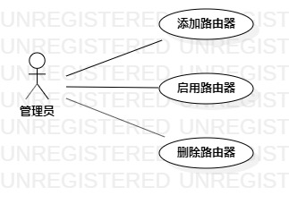

# 实验二：用例建模

## 实验目标

1. 完成选题  
2. 用例建模  
3. 编写实验报告  

## 实验内容
 
1. 创建用例图  
2. 编写实验报告  

## 实验步骤

1. 确定选题—WIFI管家  
  功能：  
  1.1 添加路由器到管理列表  
  1.2 管理路由器的状态  
  1.3 删除列表里的路由器  
2. 根据选题，创建用例图  
3. 创建Actor管理员和三个用例  
4. 建立管理员与用例关系
5. 编写用例规约  

## 实验结果

  

图1: WIFI管家的用例图

## 表1：添加用例规约  

用例编号  | UC01 | 备注  
-|:-|-  
用例名称  | 添加路由器  |   
前置条件  |      | *可选*   
后置条件  |      | *可选*   
基本流程  | 1.管理员点击添加页面按钮；  |*用例执行成功的步骤*    
~| 2.系统显示添加路由器页面；   |  
~| 3.管理员点击添加路由器按钮；   |   
~| 4.管理员输入路由器名称和密码，点击确定按钮；   |   
~| 5.系统查询路由器信息，检查路由器名称不存在，保存新增路由器信息；   |   
扩展流程  | 5.1系统发现路由器已存在，提示管理员“路由器已存在”。   |*用例执行失败*    
 

## 表2：管理用例规约  

用例编号  | UC02 | 备注  
-|:-|-  
用例名称  | 启用路由器  |   
前置条件  |      | *可选*   
后置条件  |      | *可选*   
基本流程  | 1.管理员点击管理列表按钮；  |*用例执行成功的步骤*    
~| 2.系统显示管理列表页面；  |   
~| 3.管理员点击路由器的启用按钮；   |   
~| 4.系统查询路由器状态，检查发现路由器未启用，启用路由器；   |   
~| 5.系统提示管理员“路由器已启用”。   |  
扩展流程  | 4.1系统检查发现路由器已启用，提示管理员“路由器无法重复启用”。   |*用例执行失败*    

## 表3：删除用例规约  

用例编号  | UC03 | 备注  
-|:-|-  
用例名称  | 删除路由器  |   
前置条件  |      | *可选*   
后置条件  |      | *可选*   
基本流程  | 1.管理员点击删除页面按钮；  |*用例执行成功的步骤*    
~| 2.系统显示删除路由器页面；  |  
~| 3.管理员点击删除路由器按钮  |  
~| 4.管理员输入路由器名称，点击确定按钮；  |  
~| 5.系统查询路由器信息，检查路由器存在，删除该路由器；  |  
~| 6.系统提示管理员“删除成功”。  |  
扩展流程  | 4.1系统发现路由器不存在，提示管理员“删除失败，该路由器不存在”。   |*用例执行失败*    
